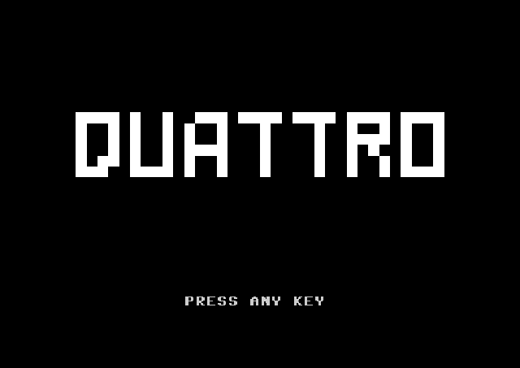

# Quattro

A sober, historically-minded falling-blocks game for Commodore 64, built with contemporary software engineering discipline.

  

## Status

**Playable alpha.**

Host-side core is tested; the C64 build is playable with a full interface flow: title screen, start/help (level 0–9, RETURN to start), gameplay, game over, and replay (RETURN again → start/help). Custom charset and further feel refinement remain optional later steps.

## Why

Quattro explores a simple question: what happens when you develop for Commodore 64 as if it were a contemporary platform with extreme constraints — without betraying its identity?

The answer is not a feature-rich reinterpretation, but a rigorous, minimal, highly playable game built with clear architecture, reproducible builds, careful optimization and obsessive attention to feel.

## Current features

- Tested host-side core (deterministic, test-backed)
- Playable C64 build (llvm-mos, runs in VICE)
- Title screen (block wordmark, PRESS ANY KEY) and start/help (level 0–9, RETURN start)
- Gameplay: board frame, HUD (SCORE / LINES / LEVEL), level-based gravity
- Game over on field + replay prompt (RETURN AGAIN → start/help)
- Same game logic on host and C64 ([host-core contract](docs/host-core-contract.md))

## Building

- **Host / tests:** `make host_debug`, `make test` (standard `cc`).
- **C64:** `make c64` (requires [llvm-mos](https://github.com/llvm-mos/llvm-mos) with `mos-c64-clang`). Run: `make c64_run` (VICE) or load `build/quattro.prg` in your emulator.
- **clangd:** `make compdb` (host) or `make compdb-all` (host + C64). Requires [Bear](https://github.com/rizsotto/Bear); generated files are not committed.
- **Browser demo (experimental):** `make web-demo` then commit `web/`; set GitHub Pages to deploy from `/web`. See [web/README.md](web/README.md).

## Controls (C64)

**Gameplay:** A / D = left / right (repeat when held) · Z / X = rotate CCW / CW · SPACE = soft drop  
**Setup:** 0–9 = start level · RETURN = start game / again after game over

## Design constraints

- **Toolchain:** llvm-mos; assembly only for isolated critical modules when profiling justifies it.
- **Rendering:** character-based board (custom charset later).
- **Core:** C only; simple deterministic PRNG; no 7-bag; CW/CCW rotation, no wall kicks by default.
- **Scope:** no hold, ghost, multiplayer, or feature creep. See [docs/scope.md](docs/scope.md).

## Repository

| Path      | Purpose                |
|-----------|------------------------|
| `docs/`   | Design, spec, roadmap  |
| `src/`    | Core, platform C64, render |
| `tests/` | Core tests             |
| `tools/` | Host debug harness     |
| `web/`   | GitHub Pages browser demo (VICE.js; experimental) |
| `assets/` | Placeholder for future |

Documentation is the source of truth for decisions and semantics. Start with [docs/host-core-contract.md](docs/host-core-contract.md) and [docs/roadmap.md](docs/roadmap.md).
