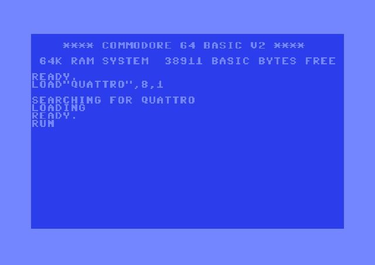

# Quattro

A sober, historically-minded falling-blocks game for Commodore 64, built with contemporary software engineering discipline.

<p align="center">
  
</p>

**Experimental browser demo:** [Play Quattro](https://jlorenzetti.github.io/quattro/)

## Status

**0.1.0** — first public release. Summary: [`release-0.1.0.md`](docs/notes/release-0.1.0.md). RC verification: [`phase-4-rc-closure.md`](docs/notes/phase-4-rc-closure.md).

The C64 build runs the full loop (title → start/help with levels 0–9 → play → game over → replay). The host-side core is tested and shared with the C64 build.

## Why

Quattro explores a simple question: what happens when you develop for Commodore 64 as if it were a contemporary platform with extreme constraints — without betraying its identity?

The answer is not a feature-rich reinterpretation, but a rigorous, minimal, highly playable game built with clear architecture, reproducible builds, careful optimization and obsessive attention to feel.

## Host-side harness

The host-side harness is intentionally austere: testable, deterministic, and slightly evocative of the Elektronika 60 lineage.

```text
quattro
seed 12345

LINES: 0000
LEVEL: 00
SCORE: 0000

<! . . . .[] . . . . .!>
<! . . . .[][][] . . .!>
<! . . . . . . . . . .!>
<! . . . . . . . . . .!>
<! . . . . . . . . . .!>
<! . . . . . . . . . .!>
<! . . . . . . . . . .!>
<! . . . . . . . . . .!>
<! . . . . . . . . . .!>
<! . . . . . . . . . .!>
<! . . . . . . . . . .!>
<! . . . . . . . . . .!>
<! . . . . . . . . . .!>
<! . . . . . . . . . .!>
<! . . . . . . . . . .!>
<! . . . . . . . . . .!>
<! . . . . . . . . . .!>
<! . . . . . . . . . .!>
<! . . . . . . . . . .!>
<! . . . . . . . . . .!>
<! . . . . . . . . . .!>
<! . . . . . . . . . .!>
<!====================!>

A/D MOVE  Z/X ROTATE  SPC DROP  G TICK  Q QUIT
```

## Current features

- Tested host-side core (deterministic, test-backed)
- C64 build (llvm-mos, VICE or hardware). Game seed from jiffy time at start; fixed seeds for host tests / debug builds.
- Title (block wordmark, PRESS ANY KEY) and start/help (level 0–9, RETURN)
- Gameplay: board frame, HUD (SCORE / LINES / LEVEL), next-piece preview, level-based gravity
- Game over on field + RETURN AGAIN → start/help
- SID micro SFX (six one-shots; mute with `QUATTRO_AUDIO=0` — **Building**, [`phase-4-micro-sfx.md`](docs/notes/phase-4-micro-sfx.md))
- Same rules on host and C64 — [`host-core-contract.md`](docs/host-core-contract.md)

## Building

- **Host / tests:** `make host_debug`, `make test` (standard `cc`).
- **C64:** `make c64` ([llvm-mos](https://github.com/llvm-mos/llvm-mos) `mos-c64-clang`). Run: `make c64_run` (VICE) or load `build/quattro.prg`. Debug seed: `make c64_fixed_seed` or `make c64 C64_DEFS="-DQUATTRO_FIXED_SEED=12345"`. Silent build: `rm -f build/quattro.prg && make c64 C64_DEFS="-DQUATTRO_AUDIO=0"`.
- **Release artifact (local):** `make release_artifacts` or `make release_artifacts VERSION=v0.1.0` copies the default PRG into `dist/` for attaching to GitHub Releases; `dist/` is local staging (gitignored) — do not commit release binaries.
- **clangd:** `make compdb` or `make compdb-all` ([Bear](https://github.com/rizsotto/Bear)); generated DBs not committed.
- **Browser demo (experimental):** Pages deploy from CI — [`README.md`](web-src/README.md).

## Controls (C64)

**Gameplay:** A / D = left / right (repeat when held) · Z / X = rotate CCW / CW · SPACE = soft drop  
**Setup:** 0–9 = start level · RETURN = start / again after game over  
**Joystick (port 2):** left / right / down / fire — move / soft drop / rotate ([`input.c`](src/platform/c64/input.c) header).

## Design constraints

- **Toolchain:** llvm-mos; assembly only where profiling justifies it.
- **Rendering:** character mode; custom charset deferred ([`custom-charset-investigation.md`](docs/notes/custom-charset-investigation.md)).
- **Core:** C; deterministic PRNG; no 7-bag; CW/CCW rotation; no wall kicks by default.
- **Scope:** see [`scope.md`](docs/scope.md).

## Documentation

| Kind | Files |
|------|--------|
| **Stable / public** | [`scope.md`](docs/scope.md), [`architecture.md`](docs/architecture.md), [`core-spec.md`](docs/core-spec.md), [`roadmap.md`](docs/roadmap.md), [`release-0.1.0.md`](docs/notes/release-0.1.0.md) |
| **Engineering notes** | [`docs/notes/`](docs/notes/) — input, performance, audio, closure records, investigations |
| **Contract** | [`host-core-contract.md`](docs/host-core-contract.md) |

Change history: [`CHANGELOG.md`](CHANGELOG.md).

## Repository

| Path      | Purpose                |
|-----------|------------------------|
| `docs/`   | Design, spec, roadmap  |
| `src/`    | Core, platform C64   |
| `tests/` | Core tests             |
| `tools/` | Host debug harness     |
| `web-src/` | Browser demo source  |
